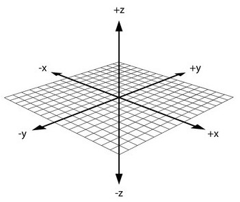

---
<!-- slide:2 Steps for big data analysis.. -->


---
<div class="my-footer"><span>UNSW Data Science Hub / <a href='https://www.unsw.edu.au/research/udash'>uDASH</a></span></div>

<!-- this adds the link footer to all slides, depends on my-footer class in css-->

```{r xaringan-logo, echo=FALSE}
xaringanExtra::use_logo(
  image_url = "images/uDASH-logo.jpg",
  position = xaringanExtra::css_position(top = "1em", right = "1em")
)
```

```{r setup, include=FALSE}
# https://www.garrickadenbuie.com/blog/decouple-code-and-output-in-xaringan-slides/
knitr::opts_chunk$set(fig.showtext=TRUE,fig.dim=c(4.8, 4.5), fig.retina=2, out.width="100%",collapse=TRUE)
```
```{r packages, include=FALSE}
library(fontawesome)
require(dplyr)
require(ggplot2)
require(tsibble)
require(readr)
require(lubridate)
require(janitor)
library(tidyr)
library(stringr)
library(knitr)
```

```{r xaringan-themer, include=FALSE, warning=FALSE}
library(xaringanthemer)
uDASH_colors <- c(blue1="#CEDAD5", blue2="#16938F", blackish="#0E0F0F", green1="#79C45E", green2="#68A170", brownish="#949494", bluish="#769CBE", greenish="#4E722F")

style_duo_accent(
  primary_color = uDASH_colors[5], secondary_color = uDASH_colors[1],
  header_font_google = google_font("Roboto Slab"),
  text_font_google   = google_font("Roboto", "300", "300i"),
  code_font_google   = google_font("Roboto Mono"),
  code_font_size = '0.7rem'
)
# for ggplot2
theme_set(theme_xaringan())
```


<!-- slide:3 Workshop Weekly schedule -->


---
# Projects

- `r fa(name = "hand-holding-heart")` Psychology: Emotions during the Pandemic

- `r fa(name = "lightbulb")` Business insights: Small Automotive Business

- `r fa(name = "gamepad")` Entertainment: Video Games Reviews

- `r fa(name = "arrow-trend-up")` Economics: Big Economic Data

- `r fa(name = "cloud-sun-rain")` Climate: Weather & Air Quality in Schools

-  Ecology: Mud Crab tracking
---
class: inverse, center, middle
# `r fa(name = "hand-holding-heart")` Psychology: Emotions during the pandemic

>In studies of emotions, a robust finding is that there is a relationship between aging and improved emotional experience. It's a well-recognized fact that older people often report higher levels of emotional wellbeing compared to younger people.


***During the pandemic, did older people still feel better emotionally than younger ones?***

---

## Emotions ...
945 participants with 107 variables!
- Primary variables:16 positive and 13 negative emotions 
  - frequency and intensity of positive emotions
  - frequency and intensity of negative emotions
  - average frequency and intensity of positive and negative emotions
  - age
- Other variables (personality traits):
  - Openness,
  - Conscientiousness
  - Extraversion
  - Agreeableness and
  - Emotional Stability

---

## Emotions ... Data

Data and metadata available here:
[`r fa(name = "link")` //osf.io/h7uqv/](https://osf.io/h7uqv/)

You can download your file from R!

```{r message=FALSE}
data_emotion <- read.csv("data/AgeAdvantagesEmotionCovid_Data.csv")
tibble(data_emotion) %>% slice_head(n=5)
```

---

## Emotions ... Cleaning/Transformation

Select subset of columns..

```{r}
# Identify columns that start with 'ftp' or 'tipi'
cols_remove <- grep("^ftp|^tipi", names(data_emotion), value = TRUE,ignore.case = TRUE)
# Remove these columns from the dataset
data_emotion <- data_emotion[, !names(data_emotion) %in% cols_remove]
tibble(data_emotion) %>% slice_head(n=5)
```

---

## Emotions ... Explore
Range of ages, mean and extreme values of intensity and frequency of emotions, personality traits
.pull-left[
```{r emotion-histogram, eval=FALSE, fig.width=2, fig.height=2}
ggplot( data=data_emotion, 
  aes(x=age))+
  geom_histogram(bins=14)+
  labs( x = "age",  y = "count")
```
```{r emotion-histogram-out, ref.label="emotion-histogram", echo=FALSE, warning=FALSE, message=FALSE}
```
]

.pull-right[
```{r emotion-gender-summary, eval=FALSE, fig.width=1, fig.height=1}
# Calculate the summary statistics
result <- aggregate(age ~ gender_all,
        data = data_emotion, summary)
#save as dataframe 
result_df <- do.call(data.frame, result)

```

<div style="float: right;">

    
    
</div>
]
---
## Emotions ... Explore
.pull-left[
```{r emotion-age-gender, eval=FALSE, fig.width=3, fig.height=3}
#Sort based on gender frequencies
data_emotion$gender_all <- 
  factor( data_emotion$gender_all,
  levels = names(sort(
  table(data_emotion$gender_all),
  decreasing = TRUE)))

#Age distribution by gender 
ggplot(data_emotion, 
  aes(x=gender_all,y=age,
  fill=gender_all)) +
  geom_violin(trim=FALSE) + 
  # Add mean and standard deviation 
  stat_summary(fun.data="mean_sdl", 
    fun.args = list(mult = 1), 
    geom="pointrange", color="black") +
  # Add box plots 
  geom_boxplot(width=0.2, fill="white") +
  scale_fill_manual(values=
    c("blue", "orange", "green", "red")) +
  theme_minimal() +
  # adjust x-axis text angle
  theme(legend.position="none", 
    axis.text.x = 
    element_text(angle=45, hjust=1))
```
]
.pull-right[
```{r emotion-age-gender-out, ref.label="emotion-age-gender", echo=FALSE, warning=FALSE, message=FALSE}
```
]

---

## Emotions ... Model

Increase or decrease of emotions by age? differences between groups?

```{r }
model <- lm(avg_i_neg ~ age,
   data_emotion)
summary(model)
```

---

## Emotions ... Visualise


Combine scatterplot and regression lines

.pull-left[
```{r emo-viz, eval=FALSE}
ggplot(data=data_emotion, 
       aes(x=age,y=avg_i_neg)) + 
  geom_point() + 
  geom_smooth(method = lm)
```
]

.pull-right[
```{r emo-viz-out, ref.label="emo-viz", echo=FALSE, warning=FALSE,message=FALSE}
```
]
---


class: inverse, center, middle

# `r fa(name = "lightbulb")` Business insights: Small automotive business

> By using data analytics, small businesses can gain insights into their customers, their products, and their operations. This information can help them make better decisions about how to run their business.

***Which customers contribute more income around the year?***


---

## Small business ...
This is a dataset of the jobs performed by a small automotive business located in Botany in 2010-2020. The dataset is itemised by each job performed and further by invoice number such that several jobs (and several cars) can be on a single invoice. The dataset also contains basic information about each car (make, model, date of last service, odometer reading), information about the date and cost of the job, and the postcode of the customer.

- Variables of interest:
  - Date of the job
  - Cost of the job
  
- Other variables:
  - Postcode of customer
  - Car make and model
  - Date of last service
  - Odometer reading

---

## Small business ... Data
You can download your file from R!
```{r message=FALSE, warning=FALSE}
data_vehicle <- read_csv("data/small_business_invoices.csv")

data_vehicle %>% slice(1:5)
```

---

##Small business ... Cleaning/Transformation
The dataset was entered by hand and thus has inconsistencies and omissions that will require cleaning.  Some data cleaning has already been performed.

.pull-left[
```{r message=FALSE,warning=FALSE}
head(data_vehicle$TRANSACTION_DATE)
#Filter out failed date conversion
data_vehicle <-
  data_vehicle %>%
  mutate(TRANSACTION_DATE =
  dmy(TRANSACTION_DATE),
  LAST_SERVICE = dmy(LAST_SERVICE)) %>%
  
  filter(!is.na(TRANSACTION_DATE)&
    !is.na(LAST_SERVICE))
```
]
.pull-right[
```{r}
#Location and servicing frequency
grouped_data <- data_vehicle %>%
  group_by(INVOICE_NO, Postcode,
  TRANSACTION_DATE, LAST_SERVICE) %>%
  summarise(total_cost = sum(TOTAL),
  vehicle_year = max(VEHICLE_YEAR),
  .groups = 'drop')
grouped_data %>% slice(1:5)

```
]
---

## Small business ...  Explore

Histogram of variables
<!--Visualizing the spread and frequency of vehicle repair costs. The following histogram represents the distribution of total costs after applying a square root transformation, which helps to reveal patterns in the data that may not be apparent in the raw numbers.-->

.pull-left[
```{r smallbiz-eda, eval=FALSE}
#frequency distribution of costs
ggplot(grouped_data) +
  geom_histogram(aes(x=total_cost)) +
  scale_x_continuous(trans = "sqrt",
  breaks=c(300,1200,3000,6000)) +
  xlab("Total cost (sq root)") +
  theme(legend.position='none',
  axis.text = element_text(size = 12,))
```
]

.pull-right[
```{r smallbiz-eda-out, ref.label="smallbiz-eda", echo=FALSE, warning=FALSE, message=FALSE}
```
]

---

## Small business ... Model

Linear regression inquiry: Does the year of manufacture of a vehicle influence its repair costs?

```{r }
model <- lm(total_cost ~ vehicle_year, data=grouped_data)
summary(model)
```
---
## Small business ... Visualise
How about total cost of vehicle repairs spread across different years?
.pull-left[
```{r smallbiz-viz, eval=FALSE}
ggplot(grouped_data)+
  geom_boxplot(aes(y=total_cost,
  x=factor(year(TRANSACTION_DATE)),
  group=factor(year(TRANSACTION_DATE)))) +
  scale_y_continuous(trans = "log") +
  xlab("Year") +
  ylab("Total (log scale)") +
  theme_minimal() +
  theme(legend.position="none", 
  axis.text.x = 
  element_text(angle=45, hjust=1))
```
]

.pull-right[
```{r smallbiz-viz-out, ref.label="smallbiz-viz", echo=FALSE, warning=FALSE, message=FALSE}
```
]

<small style="color: red;">
Can you see any outlier? What that could be?
</small>

---
class: inverse, center, middle

# `r fa(name = "gamepad")` Entertainment: Video Games Data

> The video game industry has grown from niches to mainstream. It makes now more revenue than the international film industry. It has influenced the advance of personal computers with sound cards, graphics cards and 3D graphic accelerators.

***Do Metacritic scores reflect popularity among users?***

---

## Video Games ...

The dataset presented here are the metascores of videogames from 2000 to 2018

- Variables of interest:
  - metascore: averaged scores from reviews,
  - userscore: averaged scores from user ratings,
- Other variables:
  - Console
  - Release date
  - Name of the game

---

## Video Games ... Data

The data is available from
[`r fa(name = "link")` kaggle](https://www.kaggle.com/datasets/destring/metacritic-reviewed-games-since-2000).


```{r message=FALSE}
games_data <- read_csv("data/video-games.csv")

games_data %>% slice(1:10)
```

---

## Video Games ... Cleaning/Transformation

Transform userscore from character to numeric, transform date from character to date, group consoles:

```{r}
games_data <-
  games_data %>%
  filter(!userscore %in% "tbd") %>%
  mutate(userscore=as.numeric(userscore),
        newdate=mdy(date),
        manufacturer=case_when(
          console %in% c('VITA','PSP','PS','PS2','PS3','PS4') ~ "SONY",
          console %in% c('X360','XBOX','XONE') ~ "MICROSOFT",
          console %in% c('3DS','DS','GBA','Switch','WII','WIIU','GC','N64') ~ "NINTENDO",
          console %in% c('DC') ~ "SEGA",
          TRUE ~ console
        ))
```

---

## Video Games ...  Explore

Boxplots of variables


.pull-left[
```{r game-eda, eval=FALSE}
ggplot(games_data) +
  geom_boxplot(aes(y=metascore,
                   x=manufacturer,
                   fill=manufacturer)) +
  xlab("Manufacturer") +
  ylab("Metascore") +
  theme_minimal() +
  theme(legend.position="none", 
  axis.text.x = 
  element_text(angle=45, hjust=1))
```
]

.pull-right[
```{r game-eda-out, ref.label="game-eda", echo=FALSE, warning=FALSE, message=FALSE}
```
]

---

## Video Games ... Model

Multiple linear regression

```{r }
model <- lm(userscore ~ metascore + manufacturer, data=games_data)
summary(model)
```

---

## Video Games ... Visualise


.pull-left[
```{r game-viz, eval=FALSE}
ggplot(games_data) +
  geom_point(aes(x=metascore,
                y=userscore,
                pch=manufacturer)) +
  xlab("Metascore") +
  ylab("Userscore") +
  theme(legend.position='none')
```
]

.pull-right[
```{r game-viz-out, ref.label="game-viz", echo=FALSE, warning=FALSE, message=FALSE}
```
]


---

class: inverse, center, middle

# `r fa(name = "arrow-trend-up")` Economics: Big economic data

> FRED-MD is a comprehensive collection of economic data compiled monthly by the Federal Reserve. This data is ideal for anyone interested in how the economy has changed over time. With information dating from 1959 to 2023, it covers a wide range of topics like employments, stock market prices, and production, offering a detailed look at the U.S. economy's history.  

***What drives the  economic cycles?***

---

## Big economic data ...

- Variable of interest: choose any from
  - stock market returns
  - unemployment rate
  - inflation rate, etc.
  
- Other variables:
  - financial indices
  - housing,
  - money and credits, etc

Start with a small subset of variables, and add more if you like

---

## Big economic data ... Data

Data available from the [`r fa(name = "link")` FRED homepage](https://research.stlouisfed.org/econ/mccracken/fred-databases/)


```{r  message=FALSE,warning=FALSE}
data_economic <- read_csv("data/economic-data.csv")
# Remove any excess rows
data_economic <- data_economic %>%
  slice(- 1) %>%
  slice(- (n():(n() - 2)))

# Format the date
data_economic <- data_economic %>%
  mutate(sasdate = yearmonth(sasdate))
data_economic %>% slice(1:5)
```

---

## Big economic data ... Cleaning/Transformation

Select a manageable collection of key economic indicators, exclude outliers

```{r}
data_economic <- data_economic %>%
  transmute(
    Date = sasdate,IndustrialProduction = INDPRO,
    UnemploymentRate = UNRATE, HousingStarts = HOUSTS,
    FedFundsRate = FEDFUNDS, StockMarket = `S&P 500`,
    ConsumerPriceIndex = `CPIAUCSL`,
    PersonalIncome = RPI,UnemploymentClaims = CLAIMSx)
data_economic %>% slice(1:5)
```

---

## Big economic data ... Explore

Time series analysis: Unemployment rate over time

.pull-left[
```{r eco-eda, eval=FALSE}
ggplot(data_economic,
       aes(Date, UnemploymentRate)) +
  geom_point() +
  xlab("Date") +
  ylab("Unemployment Rate (%)") +
  theme_minimal() +
  theme(legend.position="none", 
  axis.text.x = 
  element_text(angle=45, hjust=1))

```
]

.pull-right[
```{r eco-eda-out, ref.label="eco-eda", echo=FALSE, warning=FALSE, message=FALSE}
```
]


<small style="color: red;">
When was the lowest rate reported? When was the highest?
</small>


---

## Big economic data ... Model
<small>
Let's focus on how key factors are changing month-to-month rather than their specific values at any point. This approach gives us a better grasp on trends and shifts in the economy.

</small>


```{r}
eco_data_transformed <- data_economic %>%
  mutate(
    IndustrialProduction = difference(log(IndustrialProduction), diff = 1),
    UnemploymentRate = difference(UnemploymentRate, diff = 1),
    FedFundsRate = difference(FedFundsRate, diff = 1),
    HousingStarts = log(HousingStarts),#compare relative changes
    StockMarket = difference(log(StockMarket), diff = 1),
    ConsumerPriceIndex = difference(log(ConsumerPriceIndex), diff = 2),
    PersonalIncome = difference(log(PersonalIncome), diff = 1),
    UnemploymentClaims = difference(log(UnemploymentClaims), diff = 1)
    )

#apply multiple linear regression to predict the unemployment rate based on the combined influence of 4 economic factors
model <- lm(UnemploymentRate ~ ConsumerPriceIndex + IndustrialProduction + PersonalIncome
          + HousingStarts, eco_data_transformed)

```

<small style="color: red;">
 Which factors have the most influence on the unemployment rate's ups and downs?
</small>
---

## Big economic data ... Visualise

<small >
Visually examine how changes in industrial production are associated with changes in the unemployment rate while also considering the impact of inflation(combine scatterplot and regression lines).
</small>
.pull-left[
```{r eco-viz, eval=FALSE}

ggplot(data=eco_data_transformed,
  aes(y=UnemploymentRate,
      x=IndustrialProduction,
      size=ConsumerPriceIndex)) +
  geom_point() +
  geom_smooth(method = 'loess') +
  xlab("Industrial Production") +
  ylab("Unemployment Rate (%)") +
  theme_minimal() +
  theme(legend.position="none", 
  axis.text.x = element_text(
    angle=45,hjust=1))
```
]

.pull-right[
```{r eco-viz-out, ref.label="eco-viz", echo=FALSE, warning=FALSE,message=FALSE}
```
]

---

class: inverse, center, middle

# `r fa(name = "cloud-sun-rain")` Climate: Weather & Air Quality in Schools

> Good air quality in Sydney was something that many of us took for granted until the Black Summer Bushfires in 2019-2020. From serious health effects to general inconvenience, it was suddenly hard to ignore just how important the air we breathe truly is. However, fires aren’t the only phenomenon that can impact our air quality: urbanisation, pollution, and weather events can all influence our health and wellbeing.

***Can we predict air quality at UNSW using information about the weather?***

---

## Weather & Air Quality ...

This dataset contains 115 different variables documenting local weather and air quality measured at 12 different sites around Sydney.

- Weather-related variables:
  - temperature `t`, relative humidity `rh`,
  - air pressure `p`, rainfall `rain`,
  - wind direction `wd`, and wind speed `ws`

- Air-quality related variables:
  - concentrations of nitrogen dioxide `no2`, sulphur dioxide `so2`,
  - carbon monoxide `co`, ozone `o3`,
  - particulate matter <2.5μm `pm25`, and <10μm `pm10`.

Since measurements are taken every 20 minutes for the period Sep2019 - April 2021, we have 43771 data points!

---

## Weather & Air Quality ... Data

Detailed time-series weather and air-quality data collected at Sydney schools are available for download via [TERN](https://www.tern.org.au/news-swaq-data/).


```{r message=FALSE}
# reading in data
airqual <- read_csv("data/air-quality.csv") %>%
  # nice names
  clean_names()

# preview
airqual %>%
  head(3)
```

---
## Weather & Air Quality ... Cleaning/Transformation
- Time Twist: convert time format from UTC to Sydney local time.
- Data Detangle: instead of cluttered 116 columns- one new column for location and 12 other columns, each for a different climate  variable!

.pull-left[
```{r}
airqual <- airqual %>%
  # Sydney (AEST) is UTC +10
  mutate(time_local = time + hours(10))

# changing column structure of data
airqual_wide <- airqual %>%
  #filter utc
  select(-time) %>%
  pivot_longer(-time_local) %>%
  mutate(
  var_type = as.factor(
    str_sub(name, start = 6)),
  location = as.factor(
    str_sub(name, end = 4))) %>%
  select(-name) %>%
  #wider back to the format
  pivot_wider(names_from = var_type,
    values_from = value)
```
]

.pull-right[
```{r}
airqual_wide %>%
  head(5)
```
]
---

## Weather & Air Quality ... Cleaning and transformation

Lastly, we ignore the schools where there is no air quality data.

```{r, message=FALSE}
school_with_airqual_measurements <- airqual_wide %>%
  group_by(location) %>%
  select(pm10) %>% # using pm10 to check if have any air quality measurements
  summarise(num_measurements = sum(!is.na(pm10))) %>%
  ungroup() %>%
  # select only school with non-zero amount of measurements
  filter(num_measurements > 0) %>%
  # get list of schools
  pull(location)

# only want data from schools in the list we created
airqual_clean <- airqual_wide %>%
  filter(location %in% school_with_airqual_measurements)
```

---
## Weather & Air Quality ...  Explore
We've got loads of data on air quality at UNSW, and we're focusing on nitrogen dioxide (NO<sub>2</sub>) levels in January 2021.

<small style="color: red;">
Do you expect higher levels during rush hours on weekdays compared to the weekends? 
</small>

```{r}
# restricting to get UNSW data
unsw_data <- airqual_clean %>%
  # only unsw
  filter(location == "unsw") %>%
  # Jan 2021
  filter(time_local > "2021-01-01" & time_local < "2021-02-01") %>%
  # need no2 measurements
  drop_na(no2) %>%
  # only weather variables, time, and no2
  select(time_local, no2, t, rh, p, rain, wd, ws) %>%
  # get hour of the day
  mutate(hour = hour(time_local)) %>%
  # get day of the week
  mutate(dow = as.factor(wday(time_local)))
```

---

## Weather & Air Quality ...  Explore

```{r, echo=FALSE}
school_with_airqual_measurements <- airqual_wide %>%
  group_by(location) %>%
  select(pm10) %>% # using pm10 to check if have any air quality measurements
  summarise(num_measurements = sum(!is.na(pm10))) %>%
  ungroup() %>%
  # select only school with non-zero amount of measurements
  filter(num_measurements > 0) %>%
  # get list of schools
  pull(location)

# only want data from schools in the list we created
airqual_clean <- airqual_wide %>%
  filter(location %in% school_with_airqual_measurements)

# restricting to get UNSW data
unsw_data <- airqual_clean %>%
  # only unsw
  filter(location == "unsw") %>%
  # Jan 2021
  filter(time_local > "2021-01-01" & time_local < "2021-02-01") %>%
  # need no2 measurements
  drop_na(no2) %>%
  # only weather variables, time, and no2
  select(time_local, no2, t, rh, p, rain, wd, ws) %>%
  # get hour of the day
  mutate(hour = hour(time_local)) %>%
  # get day of the week
  mutate(dow = as.factor(wday(time_local)))
```

Plotting relationship between $NO_2$ and key variables for one site (UNSW):

.pull-left[
```{r airq-eda, eval=FALSE}
unsw_data %>%
  select(hour, t, rh, no2) %>%
  pivot_longer(-no2) %>%
  ggplot(aes(x = value, y = no2)) +
  geom_point() +
  facet_wrap(~ name, scales = "free_x", nrow = 2) +
  xlab("") +
  theme(axis.text.y = element_blank())
```
]

.pull-right[
```{r airq-eda-out, ref.label="airq-eda", echo=FALSE, warning=FALSE, message=FALSE}
```
]

---

## Weather & Air Quality ... Model


We noticed a strong relationship between temperature, relative humidity, and NO<sub>2</sub> concentrations. There is also some sort of cyclical relationship with the time of the day, which we can also model within multiple linear regression.

```{r }
# fitting multiple linear regression
model <- lm( no2 ~ t + rh + dow,
             data = unsw_data)
summary(model)
```

---


## Weather & Air Quality ... Visualise

We can compare predictions from our model to the observed results.
If our model was perfect, all the points should lie on the blue line.
We can see our model particularly struggles to predict the days were there are very low NO<sub>2</sub> concentrations - can you suggest why?
Also our model predicts some negative concentrations - we can definitely keep making this model better!


.pull-left[
```{r airq-viz, eval=FALSE}
cbind(unsw_data, pred = predict(model, newdata = unsw_data)) %>%
  ggplot(aes(x = no2, y = pred)) +
  geom_point() +
  geom_abline(slope = 1,
              intercept = 0,
              color = "blue") +
  xlab("Observed") +
  ylab("Predicted")
```
]

.pull-right[
```{r airq-viz-out, ref.label="airq-viz", echo=FALSE, warning=FALSE, message=FALSE}
```
]

---

class: inverse, center, middle

#   Ecology: Mud Crab Tracking

>Environmental factors such as water temperature, conductivity, and time of day significantly influence the behavioral patterns of Giant Mud Crabs, including their movement, activity levels, and periods of heightened activity

*** Are there significant correlations or patterns that can be explored to understand response to climate variability? *** 

---

## Mud Crab Tracking  ...

Crabs were tracked using acoustic telemetry, which involved attaching tags with distinct sounds.To pick up these sounds, receiver stations, functioning like listening posts, were set up in the study area. When a crab was within range of three or more receivers, its exact location could be determined. Acceleration was measured along three axes for a period of 20 seconds, recording 5 measurements per second (5 Hz).
    <div style="float:right;">
    
  </div>
- Primary variables:
  - crab: Unique identifier for each crab
  - sex: male/female
  - cl_mm: Size of the crab's shell in millimeters
  - time: Timestamp  YYYY-MM-DD hh:mm:ss
  - lat, lon: Geospatial measurements in degrees
  - x, y: The easting and northing of the detection in meters 
  - accel: The acceleration of the crab in meters per second squared 
  - temperature_c: Water temperature in degrees Celsius 
  - conductivity_ms_cm: Electrical conductivity in millisiemens per centimeter
---

## Mud Crab Tracking ... Data


Read the file and inspect columns

```{r message=FALSE}

data_crab <- read.csv("data/mud-crab-tracking.csv")
glimpse(data_crab)
```


---

## Mud Crab Tracking ... data cleaning 
Data types and formats for handling date and time are particularly important for data analysis.
The ymd_hms() function automatically handles the UTC time zone.

```{r message=FALSE}
data_crab$time <- ymd_hms(data_crab$time)
data_crab <- data_crab %>%
  dplyr::mutate(tod = lubridate::hour(time)) # this extracts the hour of the day as a number (0-23)
glimpse(data_crab)

```

---

## Mud Crab Tracking ... explore

Plot to visualize the paths of individual crabs based on their spatial coordinates

<!-- Each point represents a location (x for easting and y for northing) where a crab was detected.
Different colors represent different individual crabs, as indicated by the crab column in the dataset.

- possible task: which crab has moved most? what time?


-->


.pull-left[

```{r crab-eda, eval=FALSE, fig.width=5, fig.height=5}

ggplot( data=data_crab, 
  aes(x=x, y=y, colour=crab))+
  
  geom_path()+ 
  
  labs( x = "Easting (m)",
    y = "Northing (m)",
    colour = "Crab Id")+
  
  theme( text=element_text(size=8),
    axis.text = element_text(size =8),   
    axis.title = element_text(size =8),   
    legend.text = element_text(size =8),  
    legend.title = element_text(size =8),
    legend.position = "bottom",
    plot.margin = margin(5,5,5,5,"pt")) 

```
]


.pull-right[
```{r crab-eda-out, ref.label="crab-eda", echo=FALSE, warning=FALSE, message=FALSE}
```
]

Potential differences in behavior between individual crabs (or possibly between sexes)!
---

## Mud Crab Tracking ... explore

Number of observations per crab? How many male/female?

.pull-left[

```{r  message=FALSE}
observations <- as.data.frame(
  table(data_crab$crab))

names(observations) <- c("crab", "#Obs")
print(observations)
```
]
.pull-right[
```{r  message=FALSE}
#Group by crab and sex, and
#count the number of observations per group
subgroups <- aggregate(
  x = list(Count = data_crab$crab),
  by = list(Crab = data_crab$crab,
            Sex = data_crab$sex), 
  FUN = length) 

print(subgroups)
```
]

---

# Mud Crab Tracking ...analyse
.pull-left[
```{r  message=FALSE}
#distance between consecutive observations
data_crab <- data_crab %>%
  #observation for each crab
  dplyr::group_by(crab) %>%
  #sort by the timestamp 
  dplyr::arrange(time) %>% 
  #apply Pythagorean theorem
  dplyr::mutate(distance = 
    sqrt(((x - lag(x, n = 1)) ^ 2)+
        ((y - lag(y, n = 1)) ^ 2))) %>% 
  dplyr::ungroup()
```
]
.pull-right[

<div style="float: right;">
    
    
</div>
]
.pull-left[
```{r  message=FALSE}
#Intervals 
data_crab <- data_crab %>%
  dplyr::group_by(crab) %>% 
  dplyr::arrange(time) %>%
  # intervals between detections
  dplyr::mutate(interval = 
    as.numeric(time - lag(time,n = 1)))%>%
  dplyr::ungroup()
```
]

.pull-right[
```{r  message=FALSE}
#Speed(in metres per minute).
data_crab <- data_crab %>%
  dplyr::mutate(speed = distance/interval)
```

]
---
#Mud Crab Tracking ...analyse

<!--
Exploring the Impact of Water Temperature on Crab Behavior:
This inquiry examines whether variations in water temperature are associated with any changes in the way crabs behave. Crab behavior can be assessed through different metrics such as their movement patterns, level of activity, or feeding habits.

observations:
There is a spread of acceleration values across various temperatures.
Some crabs exhibit higher acceleration at certain temperatures, but this pattern is not uniform across all crabs.
There doesn't appear to be a clear, consistent trend that would indicate a strong correlation between water temperature and crab acceleration for all crabs. Instead, the relationship seems to vary among individual crabs.
considering other factors (like crab size, sex, or time of day) in a multivariate analysis could provide more insights into what influences crab acceleration
-->

- Some questions you may consider asking of this data
  - What effect does water temperature have on crab behavior?
  - What effect does conductivity have on crab behavior?
  - What effect does the time of day have on crab behavior?

.pull-left[

```{r crab-tempEffect, eval=FALSE, fig.width=5, fig.height=5}

ggplot(data = data_crab, 
  aes(x = temperature_c, #explanatory variable
      y = accel, #dependent variable
      colour = crab))+ #colour individual crab
  geom_point()+
  labs(x = "Water temperature (°C)",
    y = expression(
    paste("Acceleration (m s"^-2,")")),
    colour = "Crab")+
  theme( text=element_text(size=8),
    axis.text = element_text(size =8),   
    axis.title = element_text(size =8),   
    legend.text = element_text(size =8),  
    legend.title = element_text(size =8),
    legend.position = "bottom",
    plot.margin = margin(5,5,5,5,"pt")) 
```
]
.pull-right[
```{r crab-tempEffect-out, ref.label="crab-tempEffect", echo=FALSE, warning=FALSE, message=FALSE}
```
]
---
#Mud Crab Tracking ...analyse

.pull-left[

```{r crab-conductivityEffect, eval=FALSE, fig.width=5, fig.height=5}

ggplot(data = data_crab, 
  aes(x = conductivity_ms_cm, #explanatory variable
      y = accel, #dependent variable
      colour = crab))+ #colour individual crab
  geom_point()+
  labs(x = expression(
    paste("Conductivity (mS cm"^-1, ")")),
    y = expression(
    paste("Acceleration (m s"^-2,")")),
    colour = "Crab")+
  theme( text=element_text(size=8),
    axis.text = element_text(size =8),   
    axis.title = element_text(size =8),   
    legend.text = element_text(size =8),  
    legend.title = element_text(size =8),
    legend.position = "bottom",
    plot.margin = margin(5,5,5,5,"pt")) 


```
]
.pull-right[
```{r crab-conductivityEffect-out, ref.label="crab-conductivityEffect", echo=FALSE, warning=FALSE, message=FALSE}
```
]
---
#Mud Crab Tracking ...analyse

.pull-left[

```{r crab-timeEffect, eval=FALSE, fig.width=5, fig.height=5}

ggplot(data = data_crab, 
  aes(x = tod, #explanatory variable
      y = accel, #dependent variable
      colour = crab))+ #colour individual crab
  geom_point()+
  labs(x = "Time (hour) of the day",
    y = expression(
    paste("Acceleration (m s"^-2,")")),
    colour = "Crab")+
  theme( text=element_text(size=8),
    axis.text = element_text(size =8),   
    axis.title = element_text(size =8),   
    legend.text = element_text(size =8),  
    legend.title = element_text(size =8),
    legend.position = "bottom",
    plot.margin = margin(5,5,5,5,"pt")) 


```
]
.pull-right[
```{r crab-timeEffect-out, ref.label="crab-timeEffect", echo=FALSE, warning=FALSE, message=FALSE}
```
]

Can you figure out how to adapt the code above to explore the relationship between these variables and swimming/movement speed?
---


class: middle

# Choose your project

- `r fa(name = "hand-holding-heart")` Psychology: Emotions during the Pandemic 

- `r fa(name = "lightbulb")` Business insights: Small Automotive Business

- `r fa(name = "gamepad")` Entertainment: Video Games Reviews

- `r fa(name = "arrow-trend-up")` Economics: Big Economic Data

- `r fa(name = "cloud-sun-rain")` Climate: Weather & Air Quality in Schools
  
-  Ecology: Mud Crab Tracking

https://posit.cloud/content/7112209
---

# Thanks!

[`r fa(name = "twitter")` @uDASH_UNSW](https://twitter.com/uDASH_UNSW)

[`r fa(name = "house")` //www.unsw.edu.au/research/udash](https://www.unsw.edu.au/research/udash)

[`r fa(name = "paper-plane")` uDASH@unsw.edu.au](mailto:uDASH@unsw.edu.au )
